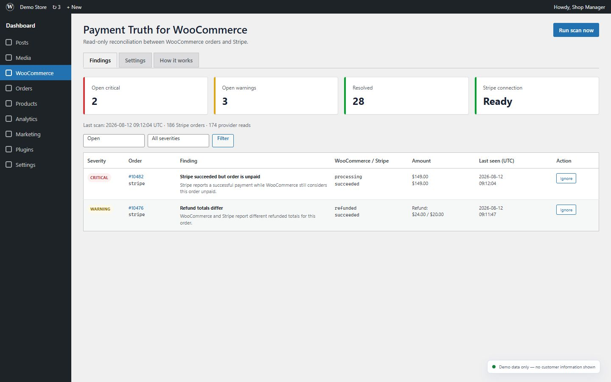
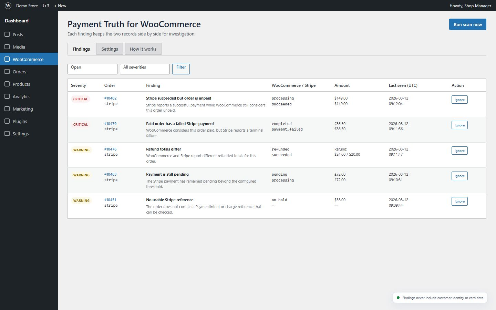
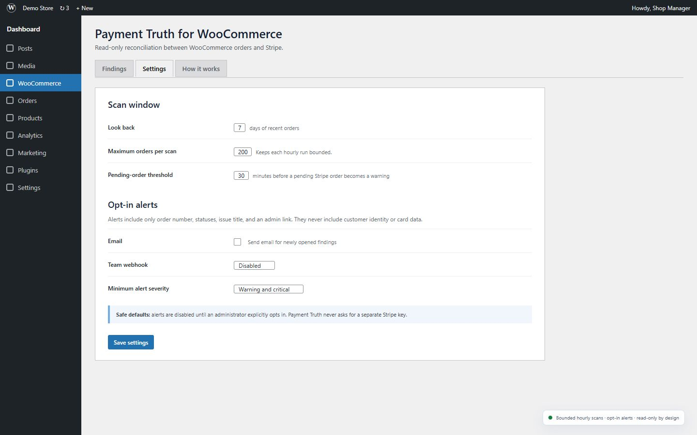

<p align="center">
  
</p>

# Payment Truth for WooCommerce

[](https://wordpress.org/plugins/payment-truth-for-woocommerce/)
[](https://wordpress.org/plugins/payment-truth-for-woocommerce/)
[](https://github.com/moxianyu6975-cpu/payment-truth-for-woocommerce/actions/workflows/ci.yml)
[](LICENSE)

**Payment Truth for WooCommerce** is a read-only reconciliation plugin for stores using the official WooCommerce Stripe Gateway. It compares recent WooCommerce orders with the matching Stripe PaymentIntent or charge and reports evidence when payment records disagree.

[Install from WordPress.org](https://wordpress.org/plugins/payment-truth-for-woocommerce/) · [Join the five-store validation](https://moxianyu6975-cpu.github.io/payment-truth-for-woocommerce/real-store-validation/) · [Read the guides](https://moxianyu6975-cpu.github.io/payment-truth-for-woocommerce/) · [Get support](https://wordpress.org/support/plugin/payment-truth-for-woocommerce/)

## Help validate it on a real store

We are looking for five WooCommerce store owners, maintainers, or agencies using the official Stripe Gateway. Run one ten-minute read-only scan and [share a redacted result](https://github.com/moxianyu6975-cpu/payment-truth-for-woocommerce/issues/new?template=real_store_feedback.yml). Healthy scans, empty scans, and scans with provider errors are all useful. Never post store, customer, order, payment, credential, or webhook identifiers.

## What it detects

- Stripe succeeded while WooCommerce still considers the order unpaid.
- WooCommerce considers the order paid while Stripe reports a terminal failure.
- Gross amount mismatches.
- Currency mismatches.
- Refund total mismatches when Stripe provides authoritative refund data.
- Stripe orders that remain pending beyond the configured threshold.
- Supported Stripe orders without a usable PaymentIntent or charge reference.

## Designed to fail safely

- **Read-only:** never captures, refunds, retries, or changes an order.
- **No extra Stripe key:** uses the official gateway's existing connection.
- **No customer PII in findings:** stores normalized payment evidence, not customer identity or card data.
- **Reduced false positives:** waits five minutes before reporting status disagreements.
- **Bounded scans:** configurable lookback and maximum-order limits for hourly and manual scans.
- **Actionable scan health:** explains provider read errors, account or mode mismatches, and the next investigation step.
- **Opt-in alerts:** email, Feishu/Lark, DingTalk, and WeCom alerts are disabled by default.
- **HPOS compatible:** reads orders through WooCommerce CRUD APIs.

A finding proves that the two records disagreed when scanned. It does **not** prove that a webhook failed or determine which system should be edited. Review the order notes, exact Stripe object, events, webhook delivery history, and relevant logs before changing fulfillment or financial state.

## Compatibility

| Requirement | Version |
|---|---|
| WordPress | 6.4 or later |
| WooCommerce | 8.2 or later |
| PHP | 7.4 or later |
| Stripe gateway | Official WooCommerce Stripe Gateway |

Version `0.2.0` supports payment methods whose IDs are `stripe` or begin with `stripe_`. Other Stripe extensions may store different identifiers and are not queried.

## Installation

1. Install and activate WooCommerce.
2. Install and configure the official WooCommerce Stripe Gateway.
3. Install [Payment Truth from WordPress.org](https://wordpress.org/plugins/payment-truth-for-woocommerce/) and activate it.
4. Open **WooCommerce → Payment Truth**.
5. Select **Run scan now** and review the findings.
6. Adjust the bounded scan window and optional alerts under **Settings**.

Payment Truth never asks you to enter a Stripe secret key.

## Screenshots

| Reconciliation overview | Evidence queue | Bounded settings |
|---|---|---|
|  |  |  |

## Evidence-first guides

- [Stripe payment succeeded but the WooCommerce order is still pending](https://moxianyu6975-cpu.github.io/payment-truth-for-woocommerce/guides/stripe-payment-succeeded-woocommerce-order-pending/)
- [How to reconcile WooCommerce orders with Stripe safely](https://moxianyu6975-cpu.github.io/payment-truth-for-woocommerce/guides/reconcile-woocommerce-stripe-payments-read-only/)
- [WooCommerce says paid but Stripe reports a failure](https://moxianyu6975-cpu.github.io/payment-truth-for-woocommerce/guides/woocommerce-paid-stripe-payment-failed/)
- [WooCommerce and Stripe amount or currency mismatch](https://moxianyu6975-cpu.github.io/payment-truth-for-woocommerce/guides/woocommerce-stripe-amount-currency-mismatch/)
- [WooCommerce and Stripe refund totals do not match](https://moxianyu6975-cpu.github.io/payment-truth-for-woocommerce/guides/woocommerce-stripe-refund-total-mismatch/)
- [Frequently asked questions](https://moxianyu6975-cpu.github.io/payment-truth-for-woocommerce/faq/)
- [Public evidence for WooCommerce Stripe reconciliation](https://moxianyu6975-cpu.github.io/payment-truth-for-woocommerce/evidence/)
- [Real-store validation program](https://moxianyu6975-cpu.github.io/payment-truth-for-woocommerce/real-store-validation/)
- [Machine-readable product summary](https://moxianyu6975-cpu.github.io/payment-truth-for-woocommerce/llms.txt)

## Development

The core regression checks have no Composer dependency:

```bash
php tests/test-core.php
php tests/test-package.php
```

Every PHP file is also syntax-checked in GitHub Actions on supported PHP versions. See [CONTRIBUTING.md](CONTRIBUTING.md) before proposing a change.

## Support and security

- Usage questions: [WordPress.org support forum](https://wordpress.org/support/plugin/payment-truth-for-woocommerce/)
- Reproducible bugs and feature requests: [GitHub Issues](https://github.com/moxianyu6975-cpu/payment-truth-for-woocommerce/issues)
- Security reports: follow [SECURITY.md](SECURITY.md) and do not publish vulnerability details in a regular issue.

## License

GPL-2.0-or-later. See [LICENSE](LICENSE).
