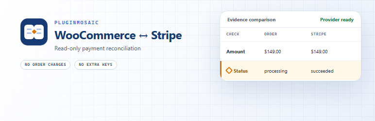

# Read-only WooCommerce Stripe reconciliation

Payment Truth for WooCommerce compares recent orders created by the official WooCommerce Stripe Gateway with their matching Stripe PaymentIntent or charge. It reports evidence when payment status, gross amount, currency, or refunded totals disagree—without changing an order or moving money.

[Install the free plugin from WordPress.org](https://wordpress.org/plugins/payment-truth-for-woocommerce/) · [Join the five-store validation](real-store-validation/) · [Share redacted scan feedback](https://github.com/moxianyu6975-cpu/payment-truth-for-woocommerce/issues/new?template=real_store_feedback.yml)

## We are validating this with five real stores

Payment Truth is public and tested, but product-market fit requires evidence from real store operations. If you use the official WooCommerce Stripe Gateway, run one ten-minute read-only scan and tell us whether the result was useful, confusing, empty, or errored. Healthy scans are useful feedback too.

[See the real-store validation steps](real-store-validation/)

## What can it find?

| Evidence pattern | Severity | What it means |
|---|---:|---|
| Stripe succeeded while WooCommerce remains unpaid | Critical | The two records disagree after the grace period. |
| WooCommerce says paid while Stripe reports terminal failure | Critical | Verify the exact provider object and any later retry. |
| Gross amount or currency differs | Critical | The normalized values differ for the linked records. |
| Refunded totals differ | Critical | WooCommerce and authoritative Stripe refund evidence disagree. |
| Pending order exceeds the configured age | Warning | The local order has remained pending longer than expected. |
| No usable Stripe reference | Warning or critical | The order cannot be matched safely to a provider object. |

These findings identify disagreements, not root causes. A finding does not prove that a webhook failed, that a customer was charged incorrectly, or that either record should be edited.

## Safe by design

- Never captures, refunds, retries, or changes an order.
- Uses the official Stripe gateway's existing connection; no extra Stripe secret key.
- Stores normalized reconciliation evidence without customer identity or card data.
- Waits five minutes before reporting status disagreements.
- Limits scheduled and manual scans to a configurable recent window.
- Keeps email and team-webhook alerts disabled until an administrator opts in.

## Evidence-first troubleshooting guides

- [Stripe payment succeeded but the WooCommerce order is still pending](guides/stripe-payment-succeeded-woocommerce-order-pending/)
- [How to reconcile WooCommerce orders with Stripe safely](guides/reconcile-woocommerce-stripe-payments-read-only/)
- [WooCommerce says paid but Stripe reports a failed or cancelled payment](guides/woocommerce-paid-stripe-payment-failed/)
- [WooCommerce and Stripe amount or currency mismatch](guides/woocommerce-stripe-amount-currency-mismatch/)
- [WooCommerce and Stripe refund totals do not match](guides/woocommerce-stripe-refund-total-mismatch/)
- [Frequently asked questions](faq/)
- [Public evidence for WooCommerce Stripe reconciliation](evidence/)
- [Real-store validation program](real-store-validation/)

## Official resources

- [WordPress.org plugin page](https://wordpress.org/plugins/payment-truth-for-woocommerce/)
- [Support forum](https://wordpress.org/support/plugin/payment-truth-for-woocommerce/)
- [Source code](https://github.com/moxianyu6975-cpu/payment-truth-for-woocommerce)
- [Machine-readable product summary](llms.txt)
- [WooCommerce Stripe documentation](https://woocommerce.com/document/stripe/)
- [Stripe PaymentIntent lifecycle](https://docs.stripe.com/payments/paymentintents/lifecycle)

